```python
# Imports

# Numpy,Pandas
import numpy as np
import pandas as pd
import datetime

# matplotlib,seaborn,pyecharts

import matplotlib.pyplot as plt
import matplotlib.gridspec as gridspec
# plt.style.use('ggplot')  #风格设置近似R这种的ggplot库
import seaborn as sns
sns.set_style('whitegrid')
%matplotlib inline
import missingno as msno

# import sklearn

from sklearn.linear_model import LogisticRegression
from sklearn.ensemble import RandomForestClassifier
from sklearn.model_selection import GridSearchCV
from sklearn.model_selection import train_test_split
from sklearn.metrics import confusion_matrix
from sklearn.metrics import precision_recall_curve
from sklearn.metrics import auc
from sklearn.metrics import roc_auc_score
from sklearn.metrics import roc_curve
from sklearn.metrics import recall_score
from sklearn.metrics import classification_report
from sklearn.metrics import accuracy_score
from sklearn.preprocessing import StandardScaler


#  忽略弹出的warnings
import warnings
warnings.filterwarnings('ignore')  

pd.set_option('display.float_format', lambda x: '%.4f' % x)

from imblearn.over_sampling import SMOTE
import itertools
```


```python
data_cr =  pd.read_csv('C:/Users/liuyu/Documents/Kaggle datasets/Credit Card Fraud Detection/creditcardfraud/creditcard.csv')
```


```python
data_cr.head()
```


<div>
<style scoped>
    .dataframe tbody tr th:only-of-type {
        vertical-align: middle;
    }

    .dataframe tbody tr th {
        vertical-align: top;
    }

    .dataframe thead th {
        text-align: right;
    }
</style>
<table border="1" class="dataframe">
  <thead>
    <tr style="text-align: right;">
      <th></th>
      <th>Time</th>
      <th>V1</th>
      <th>V2</th>
      <th>V3</th>
      <th>V4</th>
      <th>V5</th>
      <th>V6</th>
      <th>V7</th>
      <th>V8</th>
      <th>V9</th>
      <th>...</th>
      <th>V21</th>
      <th>V22</th>
      <th>V23</th>
      <th>V24</th>
      <th>V25</th>
      <th>V26</th>
      <th>V27</th>
      <th>V28</th>
      <th>Amount</th>
      <th>Class</th>
    </tr>
  </thead>
  <tbody>
    <tr>
      <th>0</th>
      <td>0.0000</td>
      <td>-1.3598</td>
      <td>-0.0728</td>
      <td>2.5363</td>
      <td>1.3782</td>
      <td>-0.3383</td>
      <td>0.4624</td>
      <td>0.2396</td>
      <td>0.0987</td>
      <td>0.3638</td>
      <td>...</td>
      <td>-0.0183</td>
      <td>0.2778</td>
      <td>-0.1105</td>
      <td>0.0669</td>
      <td>0.1285</td>
      <td>-0.1891</td>
      <td>0.1336</td>
      <td>-0.0211</td>
      <td>149.6200</td>
      <td>0</td>
    </tr>
    <tr>
      <th>1</th>
      <td>0.0000</td>
      <td>1.1919</td>
      <td>0.2662</td>
      <td>0.1665</td>
      <td>0.4482</td>
      <td>0.0600</td>
      <td>-0.0824</td>
      <td>-0.0788</td>
      <td>0.0851</td>
      <td>-0.2554</td>
      <td>...</td>
      <td>-0.2258</td>
      <td>-0.6387</td>
      <td>0.1013</td>
      <td>-0.3398</td>
      <td>0.1672</td>
      <td>0.1259</td>
      <td>-0.0090</td>
      <td>0.0147</td>
      <td>2.6900</td>
      <td>0</td>
    </tr>
    <tr>
      <th>2</th>
      <td>1.0000</td>
      <td>-1.3584</td>
      <td>-1.3402</td>
      <td>1.7732</td>
      <td>0.3798</td>
      <td>-0.5032</td>
      <td>1.8005</td>
      <td>0.7915</td>
      <td>0.2477</td>
      <td>-1.5147</td>
      <td>...</td>
      <td>0.2480</td>
      <td>0.7717</td>
      <td>0.9094</td>
      <td>-0.6893</td>
      <td>-0.3276</td>
      <td>-0.1391</td>
      <td>-0.0554</td>
      <td>-0.0598</td>
      <td>378.6600</td>
      <td>0</td>
    </tr>
    <tr>
      <th>3</th>
      <td>1.0000</td>
      <td>-0.9663</td>
      <td>-0.1852</td>
      <td>1.7930</td>
      <td>-0.8633</td>
      <td>-0.0103</td>
      <td>1.2472</td>
      <td>0.2376</td>
      <td>0.3774</td>
      <td>-1.3870</td>
      <td>...</td>
      <td>-0.1083</td>
      <td>0.0053</td>
      <td>-0.1903</td>
      <td>-1.1756</td>
      <td>0.6474</td>
      <td>-0.2219</td>
      <td>0.0627</td>
      <td>0.0615</td>
      <td>123.5000</td>
      <td>0</td>
    </tr>
    <tr>
      <th>4</th>
      <td>2.0000</td>
      <td>-1.1582</td>
      <td>0.8777</td>
      <td>1.5487</td>
      <td>0.4030</td>
      <td>-0.4072</td>
      <td>0.0959</td>
      <td>0.5929</td>
      <td>-0.2705</td>
      <td>0.8177</td>
      <td>...</td>
      <td>-0.0094</td>
      <td>0.7983</td>
      <td>-0.1375</td>
      <td>0.1413</td>
      <td>-0.2060</td>
      <td>0.5023</td>
      <td>0.2194</td>
      <td>0.2152</td>
      <td>69.9900</td>
      <td>0</td>
    </tr>
  </tbody>
</table>
<p>5 rows × 31 columns</p>
</div>


```python
data_cr.shape
```


    (284807, 31)


```python
data_cr.info()
```

    <class 'pandas.core.frame.DataFrame'>
    RangeIndex: 284807 entries, 0 to 284806
    Data columns (total 31 columns):
    Time      284807 non-null float64
    V1        284807 non-null float64
    V2        284807 non-null float64
    V3        284807 non-null float64
    V4        284807 non-null float64
    V5        284807 non-null float64
    V6        284807 non-null float64
    V7        284807 non-null float64
    V8        284807 non-null float64
    V9        284807 non-null float64
    V10       284807 non-null float64
    V11       284807 non-null float64
    V12       284807 non-null float64
    V13       284807 non-null float64
    V14       284807 non-null float64
    V15       284807 non-null float64
    V16       284807 non-null float64
    V17       284807 non-null float64
    V18       284807 non-null float64
    V19       284807 non-null float64
    V20       284807 non-null float64
    V21       284807 non-null float64
    V22       284807 non-null float64
    V23       284807 non-null float64
    V24       284807 non-null float64
    V25       284807 non-null float64
    V26       284807 non-null float64
    V27       284807 non-null float64
    V28       284807 non-null float64
    Amount    284807 non-null float64
    Class     284807 non-null int64
    dtypes: float64(30), int64(1)
    memory usage: 67.4 MB
    


```python
data_cr.describe().T
```


<div>
<style scoped>
    .dataframe tbody tr th:only-of-type {
        vertical-align: middle;
    }

    .dataframe tbody tr th {
        vertical-align: top;
    }

    .dataframe thead th {
        text-align: right;
    }
</style>
<table border="1" class="dataframe">
  <thead>
    <tr style="text-align: right;">
      <th></th>
      <th>count</th>
      <th>mean</th>
      <th>std</th>
      <th>min</th>
      <th>25%</th>
      <th>50%</th>
      <th>75%</th>
      <th>max</th>
    </tr>
  </thead>
  <tbody>
    <tr>
      <th>Time</th>
      <td>284807.0000</td>
      <td>94813.8596</td>
      <td>47488.1460</td>
      <td>0.0000</td>
      <td>54201.5000</td>
      <td>84692.0000</td>
      <td>139320.5000</td>
      <td>172792.0000</td>
    </tr>
    <tr>
      <th>V1</th>
      <td>284807.0000</td>
      <td>0.0000</td>
      <td>1.9587</td>
      <td>-56.4075</td>
      <td>-0.9204</td>
      <td>0.0181</td>
      <td>1.3156</td>
      <td>2.4549</td>
    </tr>
    <tr>
      <th>V2</th>
      <td>284807.0000</td>
      <td>0.0000</td>
      <td>1.6513</td>
      <td>-72.7157</td>
      <td>-0.5985</td>
      <td>0.0655</td>
      <td>0.8037</td>
      <td>22.0577</td>
    </tr>
    <tr>
      <th>V3</th>
      <td>284807.0000</td>
      <td>-0.0000</td>
      <td>1.5163</td>
      <td>-48.3256</td>
      <td>-0.8904</td>
      <td>0.1798</td>
      <td>1.0272</td>
      <td>9.3826</td>
    </tr>
    <tr>
      <th>V4</th>
      <td>284807.0000</td>
      <td>0.0000</td>
      <td>1.4159</td>
      <td>-5.6832</td>
      <td>-0.8486</td>
      <td>-0.0198</td>
      <td>0.7433</td>
      <td>16.8753</td>
    </tr>
    <tr>
      <th>V5</th>
      <td>284807.0000</td>
      <td>-0.0000</td>
      <td>1.3802</td>
      <td>-113.7433</td>
      <td>-0.6916</td>
      <td>-0.0543</td>
      <td>0.6119</td>
      <td>34.8017</td>
    </tr>
    <tr>
      <th>V6</th>
      <td>284807.0000</td>
      <td>0.0000</td>
      <td>1.3323</td>
      <td>-26.1605</td>
      <td>-0.7683</td>
      <td>-0.2742</td>
      <td>0.3986</td>
      <td>73.3016</td>
    </tr>
    <tr>
      <th>V7</th>
      <td>284807.0000</td>
      <td>-0.0000</td>
      <td>1.2371</td>
      <td>-43.5572</td>
      <td>-0.5541</td>
      <td>0.0401</td>
      <td>0.5704</td>
      <td>120.5895</td>
    </tr>
    <tr>
      <th>V8</th>
      <td>284807.0000</td>
      <td>-0.0000</td>
      <td>1.1944</td>
      <td>-73.2167</td>
      <td>-0.2086</td>
      <td>0.0224</td>
      <td>0.3273</td>
      <td>20.0072</td>
    </tr>
    <tr>
      <th>V9</th>
      <td>284807.0000</td>
      <td>-0.0000</td>
      <td>1.0986</td>
      <td>-13.4341</td>
      <td>-0.6431</td>
      <td>-0.0514</td>
      <td>0.5971</td>
      <td>15.5950</td>
    </tr>
    <tr>
      <th>V10</th>
      <td>284807.0000</td>
      <td>0.0000</td>
      <td>1.0888</td>
      <td>-24.5883</td>
      <td>-0.5354</td>
      <td>-0.0929</td>
      <td>0.4539</td>
      <td>23.7451</td>
    </tr>
    <tr>
      <th>V11</th>
      <td>284807.0000</td>
      <td>0.0000</td>
      <td>1.0207</td>
      <td>-4.7975</td>
      <td>-0.7625</td>
      <td>-0.0328</td>
      <td>0.7396</td>
      <td>12.0189</td>
    </tr>
    <tr>
      <th>V12</th>
      <td>284807.0000</td>
      <td>-0.0000</td>
      <td>0.9992</td>
      <td>-18.6837</td>
      <td>-0.4056</td>
      <td>0.1400</td>
      <td>0.6182</td>
      <td>7.8484</td>
    </tr>
    <tr>
      <th>V13</th>
      <td>284807.0000</td>
      <td>0.0000</td>
      <td>0.9953</td>
      <td>-5.7919</td>
      <td>-0.6485</td>
      <td>-0.0136</td>
      <td>0.6625</td>
      <td>7.1269</td>
    </tr>
    <tr>
      <th>V14</th>
      <td>284807.0000</td>
      <td>0.0000</td>
      <td>0.9586</td>
      <td>-19.2143</td>
      <td>-0.4256</td>
      <td>0.0506</td>
      <td>0.4931</td>
      <td>10.5268</td>
    </tr>
    <tr>
      <th>V15</th>
      <td>284807.0000</td>
      <td>0.0000</td>
      <td>0.9153</td>
      <td>-4.4989</td>
      <td>-0.5829</td>
      <td>0.0481</td>
      <td>0.6488</td>
      <td>8.8777</td>
    </tr>
    <tr>
      <th>V16</th>
      <td>284807.0000</td>
      <td>0.0000</td>
      <td>0.8763</td>
      <td>-14.1299</td>
      <td>-0.4680</td>
      <td>0.0664</td>
      <td>0.5233</td>
      <td>17.3151</td>
    </tr>
    <tr>
      <th>V17</th>
      <td>284807.0000</td>
      <td>-0.0000</td>
      <td>0.8493</td>
      <td>-25.1628</td>
      <td>-0.4837</td>
      <td>-0.0657</td>
      <td>0.3997</td>
      <td>9.2535</td>
    </tr>
    <tr>
      <th>V18</th>
      <td>284807.0000</td>
      <td>0.0000</td>
      <td>0.8382</td>
      <td>-9.4987</td>
      <td>-0.4988</td>
      <td>-0.0036</td>
      <td>0.5008</td>
      <td>5.0411</td>
    </tr>
    <tr>
      <th>V19</th>
      <td>284807.0000</td>
      <td>0.0000</td>
      <td>0.8140</td>
      <td>-7.2135</td>
      <td>-0.4563</td>
      <td>0.0037</td>
      <td>0.4589</td>
      <td>5.5920</td>
    </tr>
    <tr>
      <th>V20</th>
      <td>284807.0000</td>
      <td>0.0000</td>
      <td>0.7709</td>
      <td>-54.4977</td>
      <td>-0.2117</td>
      <td>-0.0625</td>
      <td>0.1330</td>
      <td>39.4209</td>
    </tr>
    <tr>
      <th>V21</th>
      <td>284807.0000</td>
      <td>0.0000</td>
      <td>0.7345</td>
      <td>-34.8304</td>
      <td>-0.2284</td>
      <td>-0.0295</td>
      <td>0.1864</td>
      <td>27.2028</td>
    </tr>
    <tr>
      <th>V22</th>
      <td>284807.0000</td>
      <td>0.0000</td>
      <td>0.7257</td>
      <td>-10.9331</td>
      <td>-0.5424</td>
      <td>0.0068</td>
      <td>0.5286</td>
      <td>10.5031</td>
    </tr>
    <tr>
      <th>V23</th>
      <td>284807.0000</td>
      <td>0.0000</td>
      <td>0.6245</td>
      <td>-44.8077</td>
      <td>-0.1618</td>
      <td>-0.0112</td>
      <td>0.1476</td>
      <td>22.5284</td>
    </tr>
    <tr>
      <th>V24</th>
      <td>284807.0000</td>
      <td>0.0000</td>
      <td>0.6056</td>
      <td>-2.8366</td>
      <td>-0.3546</td>
      <td>0.0410</td>
      <td>0.4395</td>
      <td>4.5845</td>
    </tr>
    <tr>
      <th>V25</th>
      <td>284807.0000</td>
      <td>0.0000</td>
      <td>0.5213</td>
      <td>-10.2954</td>
      <td>-0.3171</td>
      <td>0.0166</td>
      <td>0.3507</td>
      <td>7.5196</td>
    </tr>
    <tr>
      <th>V26</th>
      <td>284807.0000</td>
      <td>0.0000</td>
      <td>0.4822</td>
      <td>-2.6046</td>
      <td>-0.3270</td>
      <td>-0.0521</td>
      <td>0.2410</td>
      <td>3.5173</td>
    </tr>
    <tr>
      <th>V27</th>
      <td>284807.0000</td>
      <td>-0.0000</td>
      <td>0.4036</td>
      <td>-22.5657</td>
      <td>-0.0708</td>
      <td>0.0013</td>
      <td>0.0910</td>
      <td>31.6122</td>
    </tr>
    <tr>
      <th>V28</th>
      <td>284807.0000</td>
      <td>-0.0000</td>
      <td>0.3301</td>
      <td>-15.4301</td>
      <td>-0.0530</td>
      <td>0.0112</td>
      <td>0.0783</td>
      <td>33.8478</td>
    </tr>
    <tr>
      <th>Amount</th>
      <td>284807.0000</td>
      <td>88.3496</td>
      <td>250.1201</td>
      <td>0.0000</td>
      <td>5.6000</td>
      <td>22.0000</td>
      <td>77.1650</td>
      <td>25691.1600</td>
    </tr>
    <tr>
      <th>Class</th>
      <td>284807.0000</td>
      <td>0.0017</td>
      <td>0.0415</td>
      <td>0.0000</td>
      <td>0.0000</td>
      <td>0.0000</td>
      <td>0.0000</td>
      <td>1.0000</td>
    </tr>
  </tbody>
</table>
</div>


```python
msno.matrix(data_cr)
```


    <matplotlib.axes._subplots.AxesSubplot at 0x1ea2f915588>


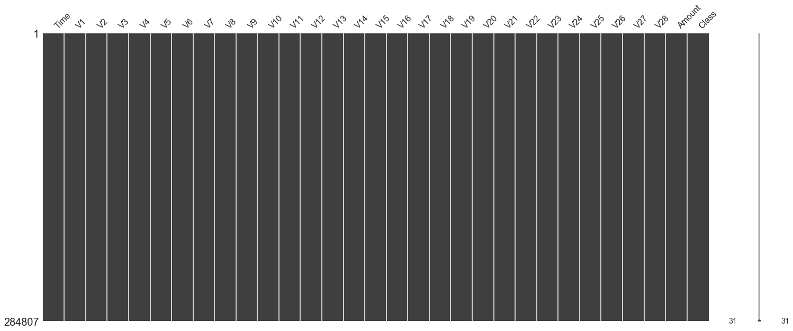


## Feature engineering


```python
fig, axs = plt.subplots(1,2,figsize=(14,7))
sns.countplot(x='Class',data=data_cr,ax=axs[0])
axs[0].set_title("Frequency of each Class")
data_cr['Class'].value_counts().plot(x=None,y=None, kind='pie', ax=axs[1],autopct='%1.2f%%')
axs[1].set_title("Percentage of each Class")
plt.show()
```


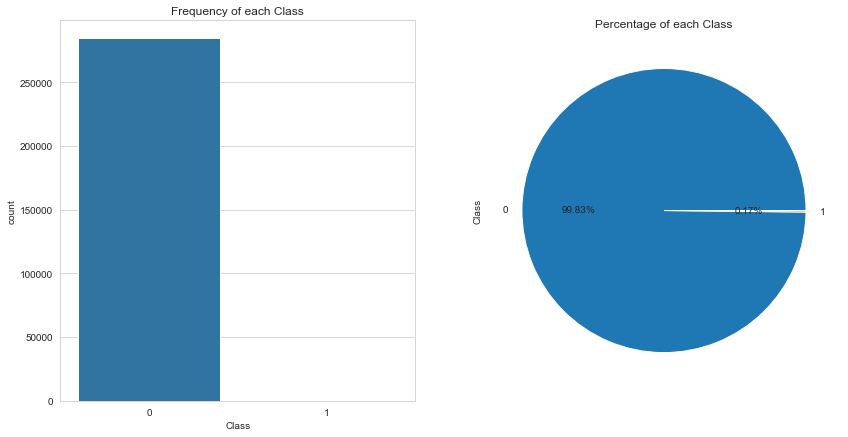


```python
data_cr.groupby('Class').size()
```


    Class
    0    284315
    1       492
    dtype: int64


```python
#数据集284,807笔交易中有492笔是信用卡被盗刷交易，信用卡被盗刷交易占总体比例为0.17%，
#信用卡交易正常和被盗刷两者数量不平衡，样本不平衡影响分类器的学习，稍后我们将会使用过采样的方法解决样本不平衡的问题。
```


```python
#特征Time的单为秒，我们将其转化为以小时为单位对应每天的时间。
data_cr['Hour'] =data_cr["Time"].apply(lambda x : divmod(x, 3600)[0]) #单位转换
```


```python
Xfraud = data_cr.loc[data_cr["Class"] == 1] # update Xfraud & XnonFraud with cleaned data
XnonFraud = data_cr.loc[data_cr["Class"] == 0]

correlationNonFraud = XnonFraud.loc[:, data_cr.columns != 'Class'].corr()
mask = np.zeros_like(correlationNonFraud)
indices = np.triu_indices_from(correlationNonFraud)
mask[indices] = True

grid_kws = {"width_ratios": (.9, .9, .05), "wspace": 0.2}
f, (ax1, ax2, cbar_ax) = plt.subplots(1, 3, gridspec_kw=grid_kws, \
                                     figsize = (14, 9))

cmap = sns.diverging_palette(220, 8, as_cmap=True)
ax1 =sns.heatmap(correlationNonFraud, ax = ax1, vmin = -1, vmax = 1, \
    cmap = cmap, square = False, linewidths = 0.5, mask = mask, cbar = False)
ax1.set_xticklabels(ax1.get_xticklabels(), size = 16); 
ax1.set_yticklabels(ax1.get_yticklabels(), size = 16); 
ax1.set_title('Normal', size = 20)

correlationFraud = Xfraud.loc[:, data_cr.columns != 'Class'].corr()
ax2 = sns.heatmap(correlationFraud, vmin = -1, vmax = 1, cmap = cmap, \
 ax = ax2, square = False, linewidths = 0.5, mask = mask, yticklabels = False, \
    cbar_ax = cbar_ax, cbar_kws={'orientation': 'vertical', \
                                 'ticks': [-1, -0.5, 0, 0.5, 1]})
ax2.set_xticklabels(ax2.get_xticklabels(), size = 16); 
ax2.set_title('Fraud', size = 20);

cbar_ax.set_yticklabels(cbar_ax.get_yticklabels(), size = 14)
```


    [Text(1, -1.0, '−1.0'),
     Text(1, -0.5, '−0.5'),
     Text(1, 0.0, '0.0'),
     Text(1, 0.5, '0.5'),
     Text(1, 1.0, '1.0')]


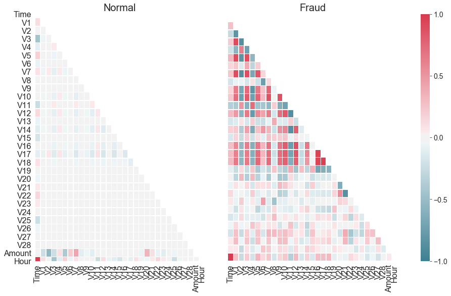


```python
f, (ax1, ax2) = plt.subplots(2, 1, sharex=True, figsize=(16,4))

bins = 30

ax1.hist(data_cr["Amount"][data_cr["Class"]== 1], bins = bins)
ax1.set_title('Fraud')

ax2.hist(data_cr["Amount"][data_cr["Class"] == 0], bins = bins)
ax2.set_title('Normal')

plt.xlabel('Amount ($)')
plt.ylabel('Number of Transactions')
plt.yscale('log')
plt.show()
```


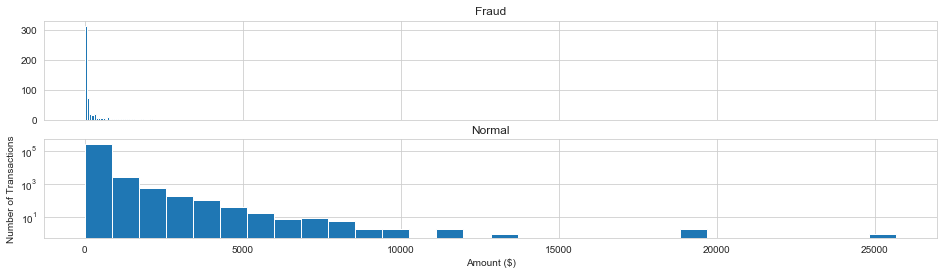


```python
sns.factorplot(x="Hour", data=data_cr, kind="count",  palette="ocean", size=6, aspect=3)
```


    <seaborn.axisgrid.FacetGrid at 0x1ea3003c160>


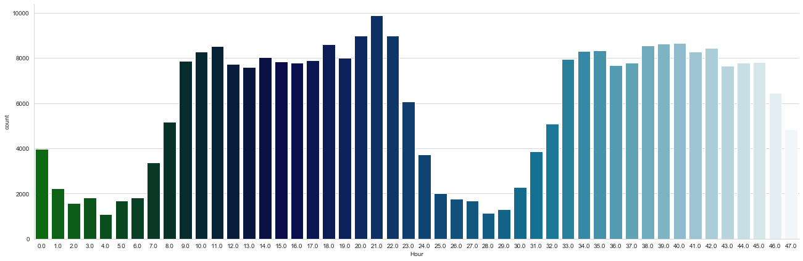


```python
f, (ax1, ax2) = plt.subplots(2, 1, sharex=True, figsize=(16,6))

ax1.scatter(data_cr["Hour"][data_cr["Class"] == 1], data_cr["Amount"][data_cr["Class"]  == 1])
ax1.set_title('Fraud')

ax2.scatter(data_cr["Hour"][data_cr["Class"] == 0], data_cr["Amount"][data_cr["Class"] == 0])
ax2.set_title('Normal')

plt.xlabel('Time (in Hours)')
plt.ylabel('Amount')
plt.show()
```


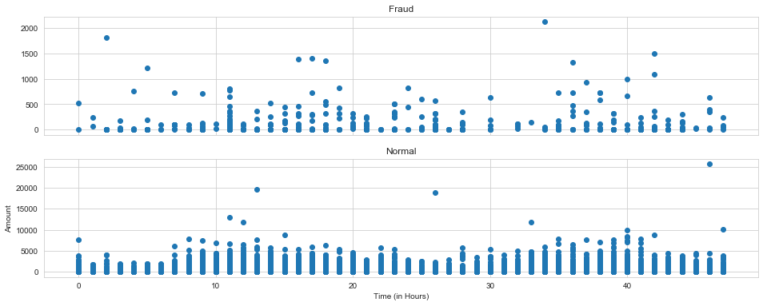


```python
#Select only the anonymized features. #enumerate可以多返回一个index
v_feat = data_cr.ix[:,1:29].columns
plt.figure(figsize=(16,28*4))
gs = gridspec.GridSpec(28, 1)
for i, cn in enumerate(data_cr[v_feat]):
    ax = plt.subplot(gs[i])
    sns.distplot(data_cr[cn][data_cr["Class"] == 1], bins=50)
    sns.distplot(data_cr[cn][data_cr["Class"] == 0], bins=100)
    ax.set_xlabel('')
    ax.set_title('histogram of feature: ' + str(cn))
```


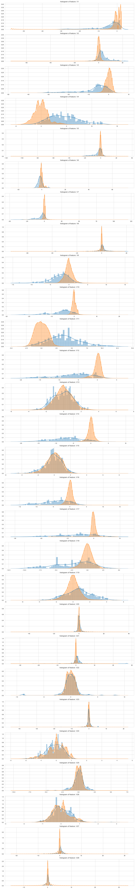


```python
droplist = ['V8', 'V13', 'V15', 'V20', 'V21', 'V22', 'V23', 'V24', 'V25', 'V26', 'V27', 'V28','Time']
data_new = data_cr.drop(droplist, axis = 1)
```


```python
# 对Amount和Hour 进行特征缩放
col = ['Amount','Hour']
from sklearn.preprocessing import StandardScaler # 导入模块
sc =StandardScaler() # 初始化缩放器
data_new[col] =sc.fit_transform(data_new[col])#对数据进行标准化
data_new.head()
```


<div>
<style scoped>
    .dataframe tbody tr th:only-of-type {
        vertical-align: middle;
    }

    .dataframe tbody tr th {
        vertical-align: top;
    }

    .dataframe thead th {
        text-align: right;
    }
</style>
<table border="1" class="dataframe">
  <thead>
    <tr style="text-align: right;">
      <th></th>
      <th>V1</th>
      <th>V2</th>
      <th>V3</th>
      <th>V4</th>
      <th>V5</th>
      <th>V6</th>
      <th>V7</th>
      <th>V9</th>
      <th>V10</th>
      <th>V11</th>
      <th>V12</th>
      <th>V14</th>
      <th>V16</th>
      <th>V17</th>
      <th>V18</th>
      <th>V19</th>
      <th>Amount</th>
      <th>Class</th>
      <th>Hour</th>
    </tr>
  </thead>
  <tbody>
    <tr>
      <th>0</th>
      <td>-1.3598</td>
      <td>-0.0728</td>
      <td>2.5363</td>
      <td>1.3782</td>
      <td>-0.3383</td>
      <td>0.4624</td>
      <td>0.2396</td>
      <td>0.3638</td>
      <td>0.0908</td>
      <td>-0.5516</td>
      <td>-0.6178</td>
      <td>-0.3112</td>
      <td>-0.4704</td>
      <td>0.2080</td>
      <td>0.0258</td>
      <td>0.4040</td>
      <td>0.2450</td>
      <td>0</td>
      <td>-1.9603</td>
    </tr>
    <tr>
      <th>1</th>
      <td>1.1919</td>
      <td>0.2662</td>
      <td>0.1665</td>
      <td>0.4482</td>
      <td>0.0600</td>
      <td>-0.0824</td>
      <td>-0.0788</td>
      <td>-0.2554</td>
      <td>-0.1670</td>
      <td>1.6127</td>
      <td>1.0652</td>
      <td>-0.1438</td>
      <td>0.4639</td>
      <td>-0.1148</td>
      <td>-0.1834</td>
      <td>-0.1458</td>
      <td>-0.3425</td>
      <td>0</td>
      <td>-1.9603</td>
    </tr>
    <tr>
      <th>2</th>
      <td>-1.3584</td>
      <td>-1.3402</td>
      <td>1.7732</td>
      <td>0.3798</td>
      <td>-0.5032</td>
      <td>1.8005</td>
      <td>0.7915</td>
      <td>-1.5147</td>
      <td>0.2076</td>
      <td>0.6245</td>
      <td>0.0661</td>
      <td>-0.1659</td>
      <td>-2.8901</td>
      <td>1.1100</td>
      <td>-0.1214</td>
      <td>-2.2619</td>
      <td>1.1607</td>
      <td>0</td>
      <td>-1.9603</td>
    </tr>
    <tr>
      <th>3</th>
      <td>-0.9663</td>
      <td>-0.1852</td>
      <td>1.7930</td>
      <td>-0.8633</td>
      <td>-0.0103</td>
      <td>1.2472</td>
      <td>0.2376</td>
      <td>-1.3870</td>
      <td>-0.0550</td>
      <td>-0.2265</td>
      <td>0.1782</td>
      <td>-0.2879</td>
      <td>-1.0596</td>
      <td>-0.6841</td>
      <td>1.9658</td>
      <td>-1.2326</td>
      <td>0.1405</td>
      <td>0</td>
      <td>-1.9603</td>
    </tr>
    <tr>
      <th>4</th>
      <td>-1.1582</td>
      <td>0.8777</td>
      <td>1.5487</td>
      <td>0.4030</td>
      <td>-0.4072</td>
      <td>0.0959</td>
      <td>0.5929</td>
      <td>0.8177</td>
      <td>0.7531</td>
      <td>-0.8228</td>
      <td>0.5382</td>
      <td>-1.1197</td>
      <td>-0.4514</td>
      <td>-0.2370</td>
      <td>-0.0382</td>
      <td>0.8035</td>
      <td>-0.0734</td>
      <td>0</td>
      <td>-1.9603</td>
    </tr>
  </tbody>
</table>
</div>


## Modeling


```python
x_feature = list(data_new.columns)
x_feature.remove('Class')
```


```python
x_val = data_new[x_feature]
y_val = data_new['Class']
```


```python
names = data_cr[x_feature].columns
from sklearn.ensemble import RandomForestClassifier
clf=RandomForestClassifier(n_estimators=10,random_state=123)#构建分类随机森林分类器
clf.fit(x_val, y_val) #对自变量和因变量进行拟合
names, clf.feature_importances_
for feature in zip(names, clf.feature_importances_):
    print(feature)
```

    ('V1', 0.016428960714381)
    ('V2', 0.01208895434189035)
    ('V3', 0.019333047192017876)
    ('V4', 0.041954380358988706)
    ('V5', 0.018124180590092024)
    ('V6', 0.021263258405632892)
    ('V7', 0.023306471455539244)
    ('V9', 0.02261630822969816)
    ('V10', 0.08104934217396947)
    ('V11', 0.06706027490232477)
    ('V12', 0.13196226602546982)
    ('V14', 0.12929955280214375)
    ('V16', 0.14082738583269538)
    ('V17', 0.21127316425921303)
    ('V18', 0.019528994094810775)
    ('V19', 0.020030149135284992)
    ('Amount', 0.011748452413655339)
    ('Hour', 0.012104857072192589)
    


```python
plt.style.use('fivethirtyeight')
plt.rcParams['figure.figsize'] = (12,6)

## feature importances 可视化##
importances = clf.feature_importances_
feat_names = names
indices = np.argsort(importances)[::-1]
fig = plt.figure(figsize=(20,6))
plt.title("Feature importances by RandomTreeClassifier")
plt.bar(range(len(indices)), importances[indices], color='lightblue',  align="center")
plt.step(range(len(indices)), np.cumsum(importances[indices]), where='mid', label='Cumulative')
plt.xticks(range(len(indices)), feat_names[indices], rotation='vertical',fontsize=14)
plt.xlim([-1, len(indices)])
```


    (-1, 18)


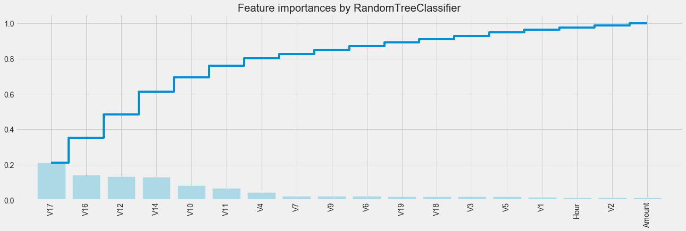


```python
X = data_cr[x_feature]
y = data_cr["Class"]
```


```python
X_train, X_test, y_train, y_test = train_test_split(X, y, test_size = 0.3, random_state = 0) # random_state = 0 每次切分的数据都一样
```


```python
from imblearn.over_sampling import SMOTE # 导入SMOTE算法模块
# 处理不平衡数据
sm = SMOTE(random_state=42)    # 处理过采样的方法
X_train, y_train = sm.fit_sample(X, y)
print('通过SMOTE方法平衡正负样本后')
n_sample = y_train.shape[0]
n_pos_sample = y_train[y_train == 0].shape[0]
n_neg_sample = y_train[y_train == 1].shape[0]
print('样本个数：{}; 正样本占{:.2%}; 负样本占{:.2%}'.format(n_sample,
                                                   n_pos_sample / n_sample, n_neg_sample/n_sample))
```

    通过SMOTE方法平衡正负样本后
    样本个数：568630; 正样本占50.00%; 负样本占50.00%
    


```python
from sklearn.linear_model import LogisticRegression
clf1 = LogisticRegression() # 构建逻辑回归分类器
clf1.fit(X_train, y_train)
```


    LogisticRegression(C=1.0, class_weight=None, dual=False, fit_intercept=True,
                       intercept_scaling=1, l1_ratio=None, max_iter=100,
                       multi_class='warn', n_jobs=None, penalty='l2',
                       random_state=None, solver='warn', tol=0.0001, verbose=0,
                       warm_start=False)


```python
predicted1 = clf.predict(X_train) # 通过分类器产生预测结果
```


```python
print("Test set accuracy score: {:.5f}".format(accuracy_score(predicted1, y_train,)))
```

    Test set accuracy score: 0.90153
    


```python
def plot_confusion_matrix(cm, classes,
                          title='Confusion matrix',
                          cmap=plt.cm.Blues):
    """
    This function prints and plots the confusion matrix.
    """
    plt.imshow(cm, interpolation='nearest', cmap=cmap)
    plt.title(title)
    plt.colorbar()
    tick_marks = np.arange(len(classes))
    plt.xticks(tick_marks, classes, rotation=0)
    plt.yticks(tick_marks, classes)

    thresh = cm.max() / 2.
    for i, j in itertools.product(range(cm.shape[0]), range(cm.shape[1])):
        plt.text(j, i, cm[i, j],
                 horizontalalignment="center",
                 color="white" if cm[i, j] > thresh else "black")

    plt.tight_layout()
    plt.ylabel('True label')
    plt.xlabel('Predicted label')
##################################################################################
```


```python

```


```python
# 构建参数组合
param_grid = {'C': [0.01,0.1, 1, 10, 100, 1000,],
                            'penalty': [ 'l1', 'l2']}

grid_search = GridSearchCV(LogisticRegression(),  param_grid, cv=10) # 确定模型LogisticRegression，和参数组合param_grid ，cv指定10折
grid_search.fit(X_train, y_train) # 使用训练集学习算法
```


    GridSearchCV(cv=10, error_score='raise-deprecating',
                 estimator=LogisticRegression(C=1.0, class_weight=None, dual=False,
                                              fit_intercept=True,
                                              intercept_scaling=1, l1_ratio=None,
                                              max_iter=100, multi_class='warn',
                                              n_jobs=None, penalty='l2',
                                              random_state=None, solver='warn',
                                              tol=0.0001, verbose=0,
                                              warm_start=False),
                 iid='warn', n_jobs=None,
                 param_grid={'C': [0.01, 0.1, 1, 10, 100, 1000],
                             'penalty': ['l1', 'l2']},
                 pre_dispatch='2*n_jobs', refit=True, return_train_score=False,
                 scoring=None, verbose=0)


```python
results = pd.DataFrame(grid_search.cv_results_) 
best = np.argmax(results.mean_test_score.values)
print("Best parameters: {}".format(grid_search.best_params_))
print("Best cross-validation score: {:.5f}".format(grid_search.best_score_))
```

    Best parameters: {'C': 1000, 'penalty': 'l1'}
    Best cross-validation score: 0.95548
    


```python
y_pred = grid_search.predict(X_test)
print("Test set accuracy score: {:.5f}".format(accuracy_score(y_test, y_pred,)))
```

    Test set accuracy score: 0.98564
    


```python
print(classification_report(y_test, y_pred))
```

                  precision    recall  f1-score   support
    
               0       1.00      0.99      0.99     85296
               1       0.10      0.90      0.18       147
    
        accuracy                           0.99     85443
       macro avg       0.55      0.94      0.58     85443
    weighted avg       1.00      0.99      0.99     85443
    
    


```python
print("Best parameters: {}".format(grid_search.best_params_))
print("Best cross-validation score: {:.5f}".format(grid_search.best_score_))
```

    Best parameters: {'C': 1000, 'penalty': 'l1'}
    Best cross-validation score: 0.95548
    


```python
# Compute confusion matrix
cnf_matrix = confusion_matrix(y_test, y_pred)  # 生成混淆矩阵
np.set_printoptions(precision=2)

print("Recall metric in the testing dataset: ", cnf_matrix[1,1]/(cnf_matrix[1,0]+cnf_matrix[1,1]))

# Plot non-normalized confusion matrix
class_names = [0,1]
plt.figure(figsize=(12,8))
plot_confusion_matrix(cnf_matrix
                      , classes=class_names
                      , title='Confusion matrix')
plt.show()
```

    Recall metric in the testing dataset:  0.8979591836734694
    


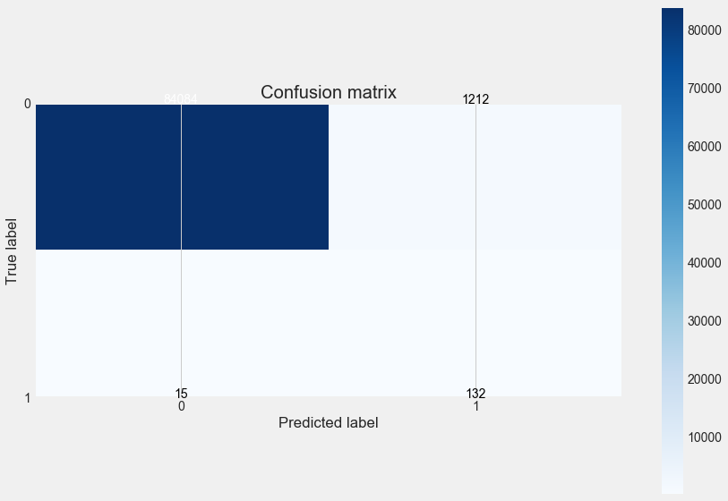


```python
147
```


```python
y_pred_proba = grid_search.predict_proba(X_test)  #predict_prob 获得一个概率值

thresholds = [0.1,0.2,0.3,0.4,0.5,0.6,0.7,0.8,0.9]  # 设定不同阈值

plt.figure(figsize=(15,12),facecolor='green')

j = 1
for i in thresholds:
    y_test_predictions_high_recall = y_pred_proba[:,1] > i#预测出来的概率值是否大于阈值 
    
    plt.subplot(3,3,j)
    j += 1
    
    # Compute confusion matrix
    cnf_matrix = confusion_matrix(y_test, y_test_predictions_high_recall)
    np.set_printoptions(precision=2)

    print("Recall metric in the testing dataset: ", cnf_matrix[1,1]/(cnf_matrix[1,0]+cnf_matrix[1,1]))

    # Plot non-normalized confusion matrix
    class_names = [0,1]
    plot_confusion_matrix(cnf_matrix
                          , classes=class_names)
    plt.tight_layout()
```

    Recall metric in the testing dataset:  0.9455782312925171
    Recall metric in the testing dataset:  0.9455782312925171
    Recall metric in the testing dataset:  0.9387755102040817
    Recall metric in the testing dataset:  0.9115646258503401
    Recall metric in the testing dataset:  0.8979591836734694
    Recall metric in the testing dataset:  0.891156462585034
    Recall metric in the testing dataset:  0.8843537414965986
    Recall metric in the testing dataset:  0.8639455782312925
    Recall metric in the testing dataset:  0.8435374149659864
    


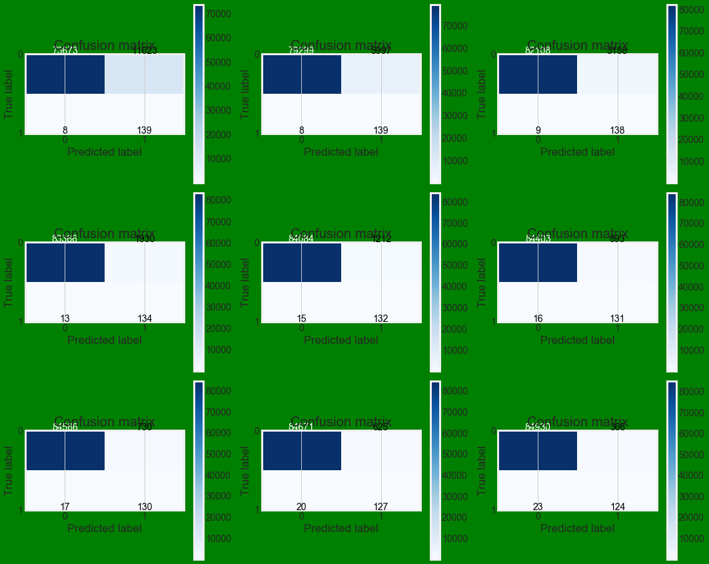


```python
y_test_predictions_prob
```


    array([False, False, False, ..., False, False, False])


```python
y_pred_proba[:,0]
```


    array([0.9 , 0.94, 0.96, ..., 0.95, 0.92, 0.73])


```python
from sklearn.metrics import roc_auc_score
```


```python
roc_auc_score(y_test,y_pred_proba[:,1])
```


    0.9775875319176629


```python
y_pred
```


    array([0, 0, 0, ..., 0, 0, 0], dtype=int64)


```python
from sklearn.metrics import roc_curve, auc
fpr, tpr, thresholds = roc_curve(y_test,y_pred_proba[:,1])
roc_auc = auc(fpr, tpr)

plt.figure()
plt.plot(fpr, tpr, color='darkorange', label='ROC curve (area = %0.2f)' % roc_auc)
plt.plot([0, 1], [0, 1], color='navy', linestyle='--')
plt.xlim([0.0, 1.0])
plt.ylim([0.0, 1.05])
plt.xlabel('False Positive Rate')
plt.ylabel('True Positive Rate')
plt.title('Receiver operating characteristic')
plt.legend(loc="lower right")
plt.show()
```


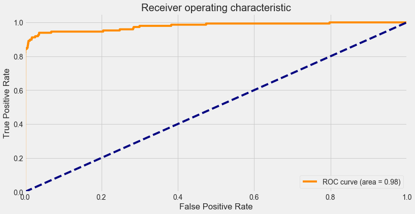


```python

```


```python

```


```python
#from itertools import cycle

#thresholds = [0.9,0.92,0.95,0.98,0.999]
#colors = cycle(['navy', 'turquoise', 'darkorange', 'cornflowerblue', 'teal'])#, 'red', 'yellow', 'green', 'blue','black'])

#plt.figure(figsize=(12,7))

#j = 1
#for i,color in zip(thresholds,colors):
 # precision, recall, thresholds = precision_recall_curve(y_test, y_test_predictions_prob)
  #  area = auc(recall, precision)
    
    # Plot Precision-Recall curve
   # plt.plot(recall, precision, color=color,
    #             label='Threshold: %s, AUC=%0.5f' %(i , area))
    #plt.xlabel('Recall')
    #plt.ylabel('Precision')
    #plt.ylim([0.0, 1.05])
    #plt.xlim([0.0, 1.0])
    #plt.title('Precision-Recall Curve')
    #plt.legend(loc="lower left")

```


```python

```
